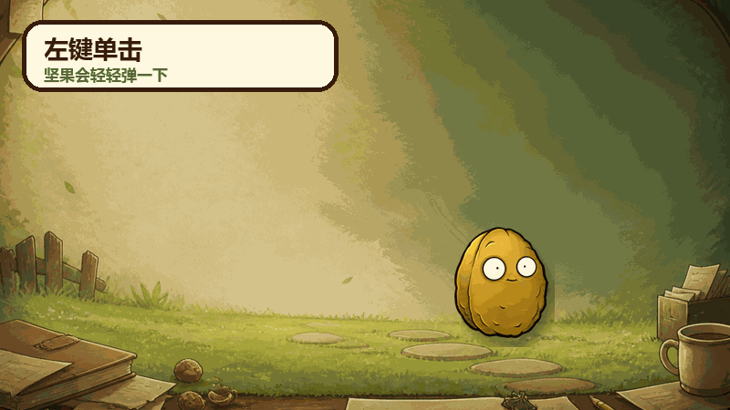

# Work Walnut

> A walnut worn down by work, remembering to rest for you.

Work Walnut is a tiny Windows desktop companion with a macOS beta. While it is running, it occasionally wobbles and gradually changes from healthy to increasingly worn-out states. Each state change may show a warm, sarcastic, or slightly strange reminder to drink water, move around, and take a break.

[中文说明](README.md) · [Usage guide](docs/USAGE.md) · [FAQ](docs/FAQ.md) · [Privacy](docs/PRIVACY.md)

## Download

Download the latest release from [GitHub Releases](https://github.com/dazhanglang778-cyber/work-walnut/releases/latest). The Windows portable archive is named:

`工作坚果-Windows-x64-v1.0.0.zip`

Extract the whole folder and double-click `启动工作坚果.exe`. No Python installation is required. Keep the EXE and its `_internal` directory together. This project does not use an MSI installer.

The Release will also include `工作坚果-macOS-arm64-v1.0.0.zip` for Apple Silicon and `工作坚果-macOS-x64-v1.0.0.zip` for Intel Macs. Extract and open `工作坚果.app`. These builds are unsigned, unnotarized betas; keep Gatekeeper enabled and only allow this individual app after verifying its Release source and SHA-256.

## Run from source

1. Install Python 3.10 or later with Tkinter support.
2. Run `python -m pip install -r requirements.txt` in the repository root.
3. Double-click `启动源码版.bat`, or run `python app/wallnut_pet.py`.

## Highlights

- Seven visual states, advancing every 45 minutes while the pet is running and Windows is awake.
- Random break-reminder speech bubbles on state changes.
- A final green overlay at 315 minutes; clicking it resets the cycle.
- Dragging, click-bounce, left-double-click rolling, and right-double-click physics launch.
- A right-click menu for manual states, reset, wobble control, and exit.
- Local-only operation with no accounts, ads, analytics, or telemetry.

## Controls

| Input | Action |
|---|---|
| Left click | Small bounce |
| Left-button drag | Move the pet and place it against screen edges |
| Left double-click | Roll twice toward the screen interior |
| Right click | Open the state and settings menu |
| Right double-click | Launch diagonally with damped edge collisions |
| Click a bubble or green overlay | Dismiss it; the end-of-cycle overlay also resets the cycle |

On a Mac trackpad, use a two-finger secondary click or Control-click for right-click actions.

## Timing model

The timer measures time while the pet process is running and the computer is awake. It does **not** monitor keyboard activity, mouse activity, or actual labor. Closing and reopening the program starts a new healthy cycle. A running instance also resets at the next calendar day.

## Privacy

Work Walnut runs locally. It does not require an account, inspect documents or browser contents, record input, or transmit telemetry. See [PRIVACY.md](docs/PRIVACY.md).

## Code license and asset boundary

The program code is licensed under **GPL-3.0-only**. Character artwork and derivative visual assets under `app/assets/` are explicitly outside the GPL grant.

The current artwork is derived from or related to *Plants vs. Zombies* visual material, and some states were based on online images whose complete authorship and license history could not be reliably traced. Free distribution and a disclaimer do not create permission. Read [ASSET_NOTICE.md](ASSET_NOTICE.md) and [DISCLAIMER.md](DISCLAIMER.md) before reuse or redistribution.

This is a free, non-commercial fan project. It is not affiliated with, authorized, sponsored, or endorsed by Electronic Arts, PopCap Games, or their affiliates.

Maintainer: `dazhanglang`
